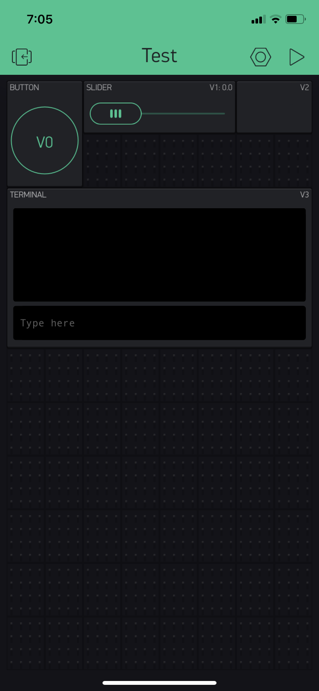

Name:Andrew Martin

EID:adm4799

Team Number:

## Questions

1. What is the purpose of an IP address?

	Gives unique name to a machine connected to a network- know who is sending/recieving 

2. What is a DNS? What are the benefits of using domain names instead of IP addresses?

    Domain Name System matches a domain to an IP, domain names are more rememberable and human orientated 

3. What is the difference between a static IP and a dynamic IP?

	Static IP never changes, dynamic IP will change- especially when connecting to a new server.

4. What is the tradeoff between UDP and TCP protocols?

    TCP is more reliable, UDP is faster 

5. Why can't we use the delay function with Blynk?

    Becuase the delay function would prevent the other routines to run- becuase the processing would be commited to the delay function

6. What does it mean for a function to be "Blocking"?

    oppertunity cost of running a function- prevents other functions

7. Why are interrupts useful for writing Non-Blocking code?

	Becuase it doesnt waste processing on checking if an event has occured, which would block other functions

8. What is the difference between interface and implementation? Why is it important?
	Interface is how or when its being use, implementation is what it is doing. Allows for abstraction and effeciency of code. (Concept of subroutine)
   

9. Screenshot of your Blynk App:

    
